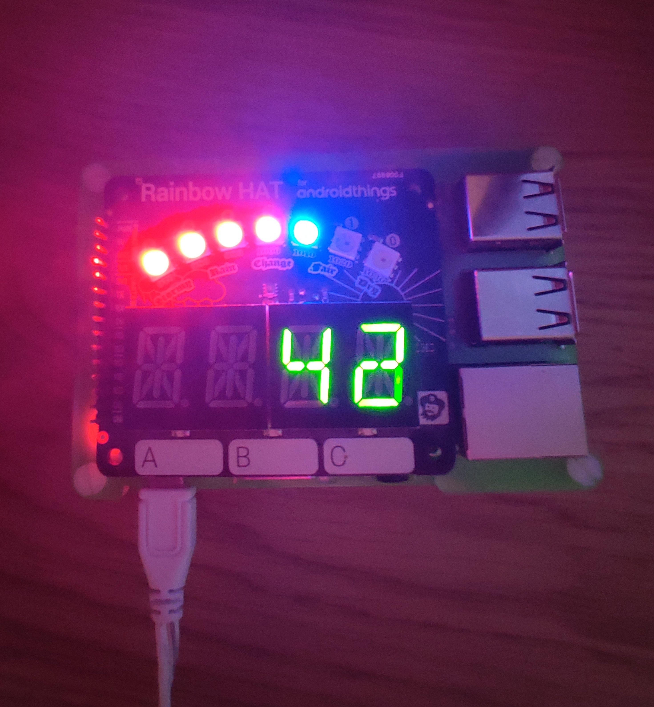

# RainbowHat-Forza
Displays Forza telemetry data on a RainbowHAT to create a physical speedometer.

The current RPM is displayed across the rainbow LEDs, and the current speed in MPH appears on the 7-segment display, updating at 60fps


## Demo




## Operation
To operate, enable Forza Horizon 5 telemetry within the game options, and point the IP at your Raspberry Pi's local network IP address, the port will default to 1024

run ```npm install ``` followed by ```sudo node index.js``` and the server will begin listening for telemetry.

As data is received, the RainbowHAT will automatically update with the incoming data

Note: must be run as sudo to gain permission to control the RainbowHAT.

This has been tested with Forza Horizon 5 only.
